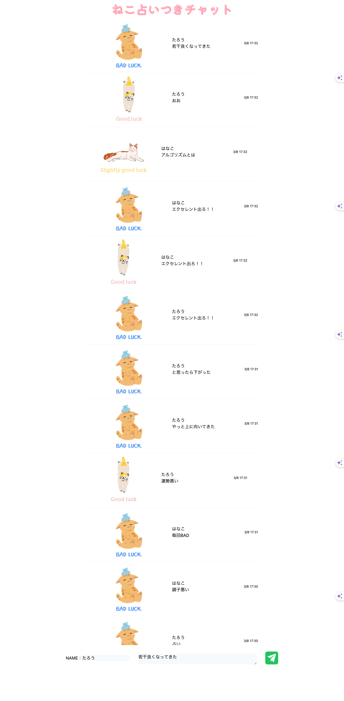

# ① 課題番号-プロダクト名

JS4 - チャットアプリ

## ② 課題内容（どんな作品か）

- 占い機能のあるチャットアプリ

## ③DEMO

## ④ 工夫した点・こだわった点

- チャットを送るたびに占いが表示されるようにした
- SNS 形式で上に追加されていく仕様にした

## ④ 難しかった点・次回トライしたいこと(又は機能)

- 配列変数の中に変数を入れる方法がわからず、AI に聞いて実装した
- 配列がよくわかっていないのでちゃんと理解してコードを書きたい
- API を使うのを次回はやってみたい

## ⑤ 質問・疑問・感想、シェアしたいこと等なんでも

- [質問]
- [疑問]
- [感想]
- [tips]
- [参考記事] [指定位置までスクロール]

### おまけ（キャプチャー画像）

